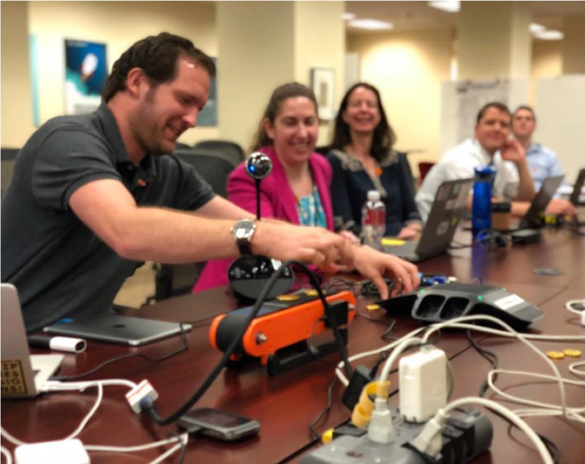

# Inter-agency Emerging Citizen Technologies Meeting  
May 9, 2018, 10:30-12:00  
U.S. National Archives and Records Administration  
700 Pennsylvania Ave NW, Washington, DC 20408  
Innovation Hub  

## Participating Agencies and Programs

|                                                        Organizations                                                                ||
| ------------------------------------------------------------|:----------------------------------------------------------------------:| 
| California Public Employees’ Retirement System              | Department of the Treasury                                             |
| Centers for Disease Control and Prevention                  | Department of the Treasury Office of Financial Research                |
| County of Yakima, Washington                                | Department of Transportation Federal Highway Administration            |
| Department of Agriculture (USDA)                            | Department of Transportation Maritime Administration                   |
| USDA Animal and Plant Health Inspection Service             | Department of Veterans Affairs                                         |
| USDA Farm Service Agency                                    | District of Columbia Department of Forensic Sciences                   |
| USDA Forest Service                                         | Export-Import Bank of the United States                                |
| Department of Defense (DOD)                                 | Federal Emergency Management Agency (FEMA)                             |
| DOD Defense Information Systems Agency                      | FEMA Office of Policy and Program Analysis                             |
| DOD Defense Logistics Innovation Agency                     | Federal Trade Commission                                               |
| DOD National Defense University                             | General Services Administration                                        |
| Department of Education                                     | General Services Administration Public Buildings Service               |
| Department of Energy                                        | General Services Administration TMF PMO                                |
| Department of Health and Human Services (HHS)               | House of Representatives                                               |
| HHS Assistant Secretary for Planning and Evaluation         | Library of Congress                                                    |
| HHS Centers for Medicare and Medicaid Services              | National Capital Planning Commission                                   |
| HHS Food and Drug Administration                            | National Weather Service                                               |
| HHS National Institutes of Health                           | Networking and Information Technology Research and Development Program |
| HHS Office of the National Coordinator for Health IT        | Railroad Retirement Board                                              |
| Department of Homeland Security (DHS)                       | State of Vermont                                                       |
| DHS Immigration and Customs Enforcement                     | U.S. Agency for International Development                              |
| DHS National Protection and Programs Directorate            | U.S. Courts                                                            |
| DHS Office of Venture and Innovation                        | U.S. Department of Justice United States Marshals Service              |
| Department of Housing and Urban Development                 | U.S. Digital Service                                                   |
| Department of Interior                                      | U.S. House Subcommittee on Information Technology                      |
| Department of Interior National Park Service                | U.S. National Archives and Records Administration                      |
| Department of Labor Equal Employment Opportunity Commission | U.S. Securities and Exchange Commission                                |
| Department of State                                         | U.S. Small Business Administration                                     |
| Department of State Office of the Inspector General         | U.S. Social Security Administration                                    |
| Department of the Air Force                                 | White House Office of Management and Budget                            |
| Department of the Navy                                      |                                                                        |

## Meeting Notes
### Welcome & Introductions, Justin Herman, GSA Emerging Citizen Technology Office (ECTO)
#### Technology Modernization Fund (TMF) Briefing, Elizabeth Cain, Executive Director - TMF PMO 
* Background: The Technology Modernization Fund PMO is partnering with the Emerging Citizen Technology Office to help agencies navigate the process and deliver the most impactful emerging technology proposals for the Fund, including programming to collaboratively develop concepts that meet the critical purpose and promise of IT modernization. 
* Details of ECTO programming supporting TMF will be distributed in the coming week on the Emerging Citizen Technology listservs. 
* **Action Item:** Questions and input for the development of ECTO programming to help agencies design and deliver emerging technology proposals for  TMF can be sent to EmergingTech@GSA.gov with “#TMF” in the subject line. 
* **Action Item:** All questions, comments and ideas can be sent to the TMF PMO:
  * elizabeth.cain@gsa.gov
  * tmf@gsa.gov

### Inter-Agency Communities Update
#### Emerging Tech Check Inter-Agency Research, Justin Herman, GSA
* Teams seeking support and resources or otherwise participating need to identify their programs in the EmergingTech Check so we can better internally coordinate and connect federal emerging technology initiatives.
* **Action Item:** All teams please spend 5 minutes in the next two weeks filling out the EmergingTech Check (link and password provided on government-only listservs). 

#### Blockchain, Sherri Sokol, Defense Information Systems Agency
* Launching monthly U.S. Federal Blockchain programming on the fourth Thursday of each month from 10:30am EST to 11:30am EST, location to be identified on Blockchain listserv. 
* Programming will include collaborative resource development, discussion, demonstrations and more. 
* A charter, short-term, mid-term and long-term goals will be drafted in the next month and need your input. 
* **Action Item:** Share ideas and suggestions to sherri.d.sokol.civ@mail.mil and EmergingTech@GSA.gov with “#Blockchain” in the subject field.

#### Artificial Intelligence, Justin Herman, GSA
* Summary of the 2018 White House Summit on Artificial Intelligence for American Industry
*   [Event Summary:] (https://www.whitehouse.gov/wp-content/uploads/2018/05/Summary-Report-of-White-House-AI-Summit.pdf)
*   [Factsheet:] (https://www.whitehouse.gov/briefings-statements/artificial-intelligence-american-people/)
*   [Article:] (https://www.whitehouse.gov/briefings-statements/artificial-intelligence-american-people/)
*   [Tweets:] (https://twitter.com/whostp?lang=en)
* Terms of Service (TOS), security and privacy review of Amazon Alexa and other related services are starting after declared business need from two dozen federal agencies, including digital assistants for navigating public spaces and responding to emergencies and disasters. 
* Launching monthly U.S. Federal Artificial Intelligence programming, location, time and date to be identified on AI for Citizen Services listserv. 
* Programming will include collaborative resource development, discussion, demonstrations and more. 
* A charter, short-term, mid-term and long-term goals will be drafted in the next month and need your input. 
* **Action Item:** Share ideas and suggestions to EmergingTech@GSA.gov with “#AI” in the subject field.

#### Robotic Process Automation, Justin Herman, GSA
* **Action Item:** We need to launch a stand-alone Robotic Process Automation program in this Spring. If you are interested in helping organize this effort email EmergingTech@GSA.gov with “#Robotics” in the subject field.

#### Virtual/Augmented Reality, Kyle Richardson, FirstNet
* Challenge: smaller companies continue to have a difficult time breaking into the federal market with regard to AR/VR. The technology innovation cycle is out of sync with the federal acquisition cycle. 
* Launching monthly U.S. Federal Virtual/Augmented Reality programming, with location, time and date to be identified on Virtual/Augmented Reality listserv. 
* Programming will include collaborative resource development, discussion, demonstrations and more. 
* A charter, short-term, mid-term and long-term goals will be drafted in the next month and need your input. 
* **Action Item:** Share ideas and suggestions to Kyle.Richardson@firstnet.gov anf EmergingTech@GSA.gov with “#VRAR” in the subject field.

### Inter-Agency Initiatives Update
#### Venture Capital Advisory Group, Jennifer Hoover, Department of Homeland Security, Venture and Innovation #InnovateDHS
* Supported West Coast trip that connected DHS leaders with venture capital leaders
* Phone meeting next week will include a discussion and action on the Venture Capital Advisory Group Charter. 
* Launching monthly U.S. Federal Venture Capital programming, with location, time and date to be identified on all of our listservs. 
* Programming will include collaborative resource development, discussion, demonstrations and more. 
* A charter, short-term, mid-term and long-term goals will be drafted in the next month and need your input. 
* **Action Item:** Share ideas and suggestions to innovatedhs@hq.dhs.gov  and EmergingTech@GSA.gov with “#Venture” in the subject field.

#### Academic Research and Civil Society Outreach, Ann Meceda, Department of State
* New monthly programming will take place on the last Tuesday of each month. Details forthcoming.
* Launching monthly Academic Research and Civil Society programming that will take place on the last Tuesday of each month. Details forthcoming.
* A charter, short-term, mid-term and long-term goals will be drafted in the next month and need your input. 
* **Action Item:** Share ideas and suggestions to mecedaa@fan.gov   and EmergingTech@GSA.gov with “#Academic” in the subject field.

#### Training and Education, Vern Wendt, National Defense University
* Meetings underway with Nvidia and their partners on Deep Learning Institute and training and education opportunities for federal managers in Artificial Intelligence. 
* First developing a curriculum strategy, then connecting agencies to these educational opportunities via DigitalGov University and other avenues as available. 
* **Action Item:** Please contact wendtv@ndu.edu and EmergingTech@GSA.gov with “#Training” in the subject line to participate or with ideas or suggestions. 

### New Business
#### Amazon Lex Demo, Tim Wilson, Amazon Web Services
* Tim gave a demonstration of a variety of AWS products including Sumerian, Lex, & Amazon's IoT service. 
* Amazon Lex is similar to the Alexa voice assistant, but while Alexa is only for Amazon Echo devices, Lex offers the same capability for any web-enabled device. 
* Amazon Sumerian is a VR/AR application for interactive 3D visuals. 
* Amazon’s IoT service creates the link between the physical and digital world, linking physical machinery, to a VR/AR model of the same machine.
* The demo included the following components:
  * Scanning a QR code on a conveyor belt, using an iPad, to create an AR version of that belt displayed on the screen. 
  * Information such as vibrations, rotations per minute, & the devices status are all displayed. 
  * A click of a button changes the mode to an “exploded” version of the conveyor belt that breaks out each individual part. 
  * In the future, this “exploded” mode will be able to highlight a specific gear or bolt that isn’t working, so engineers can proactively diagnose problems and more easily fix a large piece of machinery, without having to dismantle the entire product.

#### Announcements
* Notice: NGA is in need of a [Deputy Chief Ventures Office](https://www.usajobs.gov/GetJob/ViewDetails/498582100). This is a Defense Intelligence Senior Executive Service Tier One position, and will be based in the DC area. Please consider applying or passing this announcement to someone you know who might be interested. Applicants must be U.S. Citizens who have (or can get) a TS/SCI security clearance. Contact Jennifer Hoover if you have any questions about the opportunity.

### Next Meeting & Adjourn
* June 13, 1030-1200, U.S. National Archives and Records Administration
