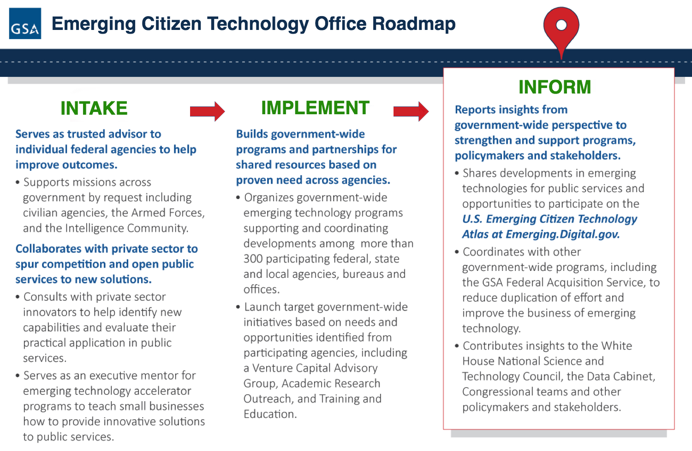

# Welcome to the U.S. Emerging Citizen Technology Atlas

Emerging technologies can hold the key to unlocking the vast potential of public services and open data for the American people, but they evolve at a speed that can be challenging for federal IT modernization efforts. This U.S. Emerging Citizen Technology Atlas is an open source resource organized by GSA's Emerging Citizen Technology Office (ECTO) to help tear down the barriers around these initiatives that anyone from federal managers and policy-makers to U.S. businesses, researchers, and the public can analyze and update with:

1. Uses and resources for the practical application of emerging technologies;
2. Reports from public service workshops, pilots, and programs;
3. Opportunities to participate and collaborate. 

The Atlas is the public-facing arm of ECTO's three pillars of support for federal emerging technologies in partnership with innovative programs and people across government:

These are just a fraction of the expansive emerging technology programs and services within the U.S. federal government, a continual work-in-progress designed to empower you to know what we know and help us all be better informed to take advantage of new opportunities and avoid pitfalls. 

We look forward to working with you to build the future now.  
